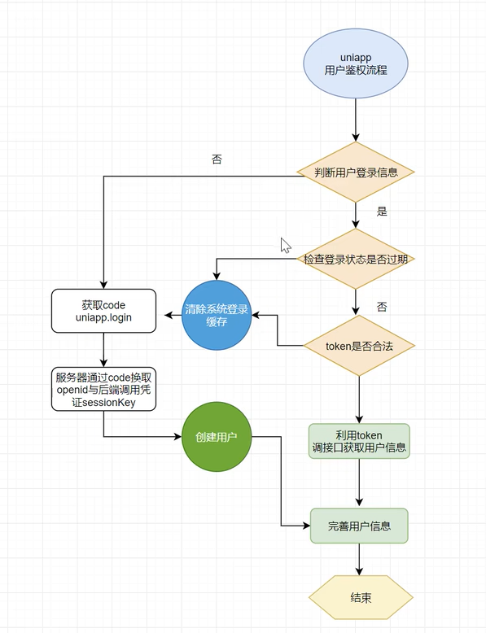

[uniapp官网](https://uniapp.dcloud.net.cn/)
[小程序IDE下载](https://developers.weixin.qq.com/miniprogram/dev/devtools/download.html)
[uview-plus](https://uview-plus.jiangruyi.com/)

v3陪诊接口文档：https://apifox.com/apidoc/shared-8776d148-3d28-42a1-bf4b-c2285ac6e644/api-264486153

## 1、三个页面使用 [tabBar](https://uniapp.dcloud.net.cn/collocation/pages.html#tabbar)

`page.json`中设置`tabbar`

```json
{
	"pages": [ //pages数组中第一项表示应用启动页，参考：https://uniapp.dcloud.io/collocation/pages
		{
			"path": "pages/index/index",
			"style": {
				"navigationBarTitleText": "首页"
			}
		},
		{
			"path" : "pages/like/like",
			"style" : 
			{
				"navigationBarTitleText" : "喜欢",
				"enablePullDownRefresh": false
			}
		},	
		{
			"path" : "pages/my/my",
			"style" : 
			{
				"navigationBarTitleText" : "我的",
				"enablePullDownRefresh": false
			}
		}
	],
	"tabBar": {
		"color": "#7a7e83",
		// 点击后的颜色
		"selectedColor": "#2867ce",
		"borderStyle": "white",
		"backgroundColor": "#fff",
		// 页面路径
		"list": [
			{
				"pagePath": "pages/index/index",	
				"iconPath": "static/tabbar/ly-home01.png",
				"selectedIconPath": "static/tabbar/ly-home.png",
				"text": "首页"
			}, {
				"pagePath": "pages/like/like",	
				"iconPath": "static/tabbar/ly-link01.png",
				"selectedIconPath": "static/tabbar/ly-link.png",
				"text": "喜欢"
			}, {
				"pagePath": "pages/my/my",	
				"iconPath": "static/tabbar/ly-my01.png",
				"selectedIconPath": "static/tabbar/ly-my.png",
				"text": "我的"
			}
		]
	}
}

```

## 2、导入uview-plus组件


### [NPM安装方式配置](https://uview-plus.jiangruyi.com/components/npmSetting.html)

跟着官网手册来配置，安装相关的库。

```
npm init -y
npm install uview-plus dayjs clipboard
```

在`main.js`中导入uviewPlus

```js
// #ifdef VUE3
import { createSSRApp } from 'vue'
import uviewPlus from 'uview-plus'
export function createApp() {
  const app = createSSRApp(App)
  app.use(uviewPlus)
  return {
    app
  }
}
// #endif
```

`uni.scss`中

```scss
@import 'uview-plus/theme.scss';
```

### 引入uview-plus基础样式

注意！

在`App.vue`中**首行**的位置引入，注意给style标签加入lang="scss"属性

### 配置manifest

在项目的manifest.json中增加mergeVirtualHostAttributes配置

```text
"mp-weixin" : {
	"appid" : "",
	...
	"mergeVirtualHostAttributes" : true
},
"mp-toutiao" : {
	"appid" : "",
	...
	"mergeVirtualHostAttributes" : true
}
```

在`pages.json`中配置

```json
	"easycom": {
		"autoscan": true,
		// 注意一定要放在custom里，否则无效，https://ask.dcloud.net.cn/question/131175
		"custom": {
			"^u--(.*)": "uview-plus/components/u-$1/u-$1.vue",
			"^up-(.*)": "uview-plus/components/u-$1/u-$1.vue",
			"^u-([^-].*)": "uview-plus/components/u-$1/u-$1.vue"
			}
		},
```

`index.vue`中

```vue
<template>
	<view class="content">
		<up-button text="渐变色按钮" color="linear-gradient(to right, rgb(66, 83, 216), rgb(213, 51, 186))"></up-button>
	</view>
</template>
```


## 3、接口和http请求封装

v3陪诊接口文档：https://apifox.com/apidoc/shared-8776d148-3d28-42a1-bf4b-c2285ac6e644/api-264486153

[uni.request(OBJECT)](https://uniapp.dcloud.net.cn/api/request/request.html#request)发起网络请求

### API的封装，http请求类

1. 处理公共的请求前和响应后的逻辑
2. 处理公共的参数和请求头

在项目根目录下新建`/api/http.js`，这个文件迎来请求api的

```js
let baseUrl = 'https://apifoxmock.com/m1/4728220-0-default'

export default function http(url, data={}, method = 'GET') {
	// 对外支持链式调用
	return new Promise((resolve, reject) => {
		uni.request({
			url: baseUrl + url,
			data,
			method,
			header: {
				'token': uni.getStorageSync('token') || ''
			},
			success: res => {
				// http 状态码
				if (res.statusCode == 200) {
					if (res.data.code == 1) {
						resolve(res.data.data)
					} else if (res.data.code == 0) {
						uni.showToast({
							title: res.data.msg,
							icon: 'none'
						})
						reject(res.data.msg)
					}
				}
			},
			fail: () => {
				uni.showToast({
					title: '服务器请求异常',
					icon: 'none'
				})
			}
		})
	})
}
```

新建`/api/api.js`

[onLOAD](https://uniapp.dcloud.net.cn/tutorial/page.html#onload)

```js
import http from "./http"

// 首页banner
export const getBanner = () => {
	return http('/user/getBanner')
}
```

在`index.vue`中调用

```vue
<script setup>
	import { getBanner } from '../../api/api.js'
	import { onLoad } from '@dcloudio/uni-app'
	
	onLoad(() => {
		getBanner().then(res => {
			console.log(res, 'res')
		})
	})
</script>
```


## 4、小程序和H5数据mock过程

微信小程序设置mock：当后端接口还没开发好，可以使用mock数据进行模拟


微信小程序mock数据

```json
{
  "statusCode": 200,
  "data": {
    "code": 1,
    "data": {
      "bannerList": [{
        "image": "http://159.75.169.224:5500/ComfyUI_00006_.png",
        "title": "身无彩凤双飞翼，心有灵犀一点通"
      }, {
        "image": "http://159.75.169.224:5500/ComfyUI_00006_.png",
        "title": "谁念西风独自凉，萧萧黄叶闭疏窗，沉思往事立残阳"
      }]
    },
    "msg": ""
  },
  "header": {
    "content-type": "application/json; charset=utf-8"
  }
}
```

代码中配置一下mock，在`api/http.js`中添加：

```js
// 通过环境来判断
if (process.env.NODE_ENV === 'development') {
	baseURL= 'http://localhost:5173/api'
} else {
	baseUrl = 'https://apifoxmock.com/m1/4728220-0-default/api'
}
```

(1)要在浏览器H5端中也能调试，需要配置

安装插件mockjs

```
npm i mockjs
```

将资料中的`mockData`粘贴到api文件夹下，新建`api/mock.js`文件

```js
import Mock from 'mockjs'
import pageApi from './mockData/pageApi.js'

// Mock.mock('http://localhost:5173/api')

// 正则匹配
Mock.mock(/api\/user\/getBanner/, 'get', pageApi.getBanner)
```

在`main.js`中导入

```js
import './api/mock.js'
```

运行在谷歌浏览器打开


## 5、首页banner和搜索

(1) 修改首页页面，添加搜索组件

`index.vue`删掉初始样式，

```vue
<template>
	<view class="content">
		
	</view>
</template>

<script setup>
	import { getBanner } from '../../api/api.js'
	import { onLoad } from '@dcloudio/uni-app'
	
	onLoad(() => {
		getBanner().then(res => {
			console.log(res, 'res')
		})
	})
</script>

<style lang="scss">
	.content {
		padding: 20px 20px;
	}
</style>
```

看下[搜索组件](https://uview-plus.jiangruyi.com/components/search.html)

```vue
<template>
	<view class="content">
		<up-search placeholder="搜索景点" bg-color="#e3e3e3" v-model="keyword"></up-search>
	</view>
</template>

<script setup>
	import { getBanner } from '../../api/api.js'
	import { onLoad } from '@dcloudio/uni-app'
	import {
		ref,
		reactive
	} from 'vue'
	
	const keyword = ref('')
	
	onLoad(() => {
		getBanner().then(res => {
			console.log(res, 'res')
		})
	})
</script>
```

重启一下，显示正常：


（2）显示[swiper轮播图](https://uview-plus.jiangruyi.com/components/swiper.html)

这里主要需要熟悉`up-swiper`标签的属性：

- 添加v-if，因为bannerList最初的时候是空的，直接渲染会出错，添加v-if判断一下
- keyName：list数组中指定对象的目标属性名
- showTitle：是否显示标题，要求数组对象中有title属性
- list：轮播图数据，见上方"基本使用"说明
- autoplay：是否自动切换

```vue
<template>
	<view class="content">
		<up-search placeholder="搜索景点" bg-color="#e3e3e3" v-model="keyword"></up-search>
		<up-swiper v-if="bannerList.length" keyName="image" showTitle="title" :list="bannerList" radius="8" :autoplay="true" height="160"></up-swiper>
	</view>
</template>

<script setup>
	import { getBanner } from '../../api/api.js'
	import { onLoad } from '@dcloudio/uni-app'
	import {
		ref,
		reactive
	} from 'vue'
	
	const keyword = ref('')
	const bannerList = ref([])
	
	onLoad(() => {
		getBanner().then(res => {
			console.log(res, 'res')
			bannerList.value = res.bannerList
		})
	})
</script>
```

修改`htpp.js`，开发环境依旧使用`baseUrl = 'https://apifoxmock.com/m1/4728220-0-default/api'`

```js
// 通过环境来判断
if (process.env.NODE_ENV === 'development') {
	// baseUrl = 'http://localhost:5173/api'
	baseUrl = 'https://apifoxmock.com/m1/4728220-0-default/api'
} else {
	baseUrl = 'https://apifoxmock.com/m1/4728220-0-default/api'
}
```

运行后：


（3）添加[NoticeBar](https://uview-plus.jiangruyi.com/components/noticeBar.html)组件

```vue
<template>
	<view class="content">
		<up-search placeholder="搜索景点" bg-color="#e3e3e3" v-model="keyword"></up-search>
		<up-swiper v-if="bannerList.length" keyName="image" showTitle="title" :list="bannerList" radius="8" :autoplay="true" height="160"></up-swiper>
		<up-notice-bar text="项目数据仅为实例,非真实数据"></up-notice-bar>
	</view>
</template>
```


（4）添加[Waterfall瀑布流](https://uview-plus.jiangruyi.com/components/waterfall.html)

```vue
<template>
	<view class="content">
		<view class="list">
			<up-waterfall v-model="flowList" ref=waterfallRef""></up-waterfall>
		</view>
	</view>
</template>

<script setup>
	// 瀑布流数据
	const flowList = ref([])
</script>
```

`api.js`中

```js
// 首页列表
export const getHomeList = () => {
	return http('/user/getHomeList')
}
```


`index.vue`中引入`getHomeList`进来

```vue
<script setup>
	import { getBanner, getHomeList } from '../../api/api.js'
	// 瀑布流数据
	const flowList = ref([])
	onLoad(() => {
			getHomeList().then(res => {
			console.log(res, 'getHomeList')
			flowList.value = res
		})
	})
</script>
```

布局：

```vue
<template>
	<view class="content">
		<view class="list">
			<up-waterfall v-model="flowList" ref="waterfallRef">
				<template v-slot:left="{ leftList }">
					<view class="demo-water">
						
					</view>
				</template>
				<template v-slot:right="{ rightList }">
					
				</template>
			</up-waterfall>
		</view>
	</view>
</template>
```

对对应瀑布流设置样式：

```vue
<style lang="scss">
	.list {
		margin: 30px 0;
		.demo-water {
			margin: 10rpx 10rpx 10rpx 0;
			background-color: #fff;
			border-radius: 16rpx;
			padding: 16rpx;
		}
	}
</style>
```

（5）使用`lazy-load`显示图片，并且设置格式

```vue
<template>
	<view class="content">
		<up-search placeholder="搜索景点" bg-color="#e3e3e3" v-model="keyword"></up-search>
		<up-swiper v-if="bannerList.length" keyName="image" showTitle="title" :list="bannerList" radius="8" :autoplay="true" height="160"></up-swiper>
		<up-notice-bar text="项目数据仅为实例,非真实数据"></up-notice-bar>
		<view class="list">
			<up-waterfall v-model="flowList" ref="waterfallRef">
				<template v-slot:left="{ leftList }">
					<view class="demo-water" v-for="(item, index) in leftList" :key="index">
						<up-lazy-load threshold="-450" border-radius="10" :image="item.img" :index="index"></up-lazy-load>
						<view class="demo-title">{{ item.title}}</view>
						<view class="demo-price">{{ item.times}}</view>
						<view class="demo-tag">
							<view class="demo-tag-owner">
								{{ item.tag[0] }}
							</view>
							<view class="demo-tag-text">
								{{ item.tag[1] }}
							</view>
						</view>
						<view class="isDot" v-if="item.isDot">
							{{ item.isDot }}
						</view>
					</view>
				</template>
				<template v-slot:right="{ rightList }">
					
				</template>
			</up-waterfall>
		</view>
	</view>
</template>

<style lang="scss">
	.content {
		padding: 20rpx 20rpx;
		.list {
			margin: 30px 0;
			.demo-water {
				margin: 10rpx 10rpx 10rpx 0;
				background-color: #fff;
				border-radius: 16rpx;
				padding: 16rpx;
				position: relative;
			}
		}
		.demo-title {
			font-size: 30rpx;
			margin-top: 10rpx;
			color: #303133;
		}
		.demo-price {
			font-size: 24rpx;
			color: #777;
			margin-top: 10rpx;
		}
		.demo-tag {
			display: flex;
			margin-top: 10rpx;
			.demo-tag-owner {
				border: 1px solid rgb(252,163,129);
				color: #ffaa00;
				font-size: 20rpx;
				display: flex;
				align-items: center;
				padding: 4rpx 14rpx;
				border-radius: 50rpx;
			}
			.demo-tag-text {
				border: 1px solid #00aaff;
				color: #00aaff;
				margin-left: 24rpx;
				border-radius: 50rpx;
				padding: 4rpx 14rpx;
				font-size: 20rpx;
				display: flex;
				align-items: center;
			}
		}
		.isDot {
			position: absolute;
				top: 20rpx;
				right: 20rpx;
				font-size: 24rpx;
				color: #fff;
				background-color: #ff0000;
				line-height: 32rpx;
				text-align: center;
				border-radius: 10rpx;
				padding: 4rpx 10rpx;
		}
	}
</style>
```


## 6、瀑布流右侧内容和置顶功能实现

（1）触底就加载新的图片

复制`leftList`的到right中

```vue
	<template v-slot:right="{ rightList }">
					<view class="demo-water" v-for="(item, index) in rightList" :key="index">
							<up-lazy-load threshold="-450" border-radius="10" :image="item.img" :index="index"></up-lazy-load>
							<view class="demo-title">{{ item.title}}</view>
							<view class="demo-price">{{ item.times}}</view>
							<view class="demo-tag">
								<view class="demo-tag-owner">
									{{ item.tag[0] }}
								</view>
								<view class="demo-tag-text">
									{{ item.tag[1] }}
								</view>
							</view>
							<view class="isDot" v-if="item.isDot">
								{{ item.isDot }}
							</view>
						</view>
				</template>			
```

运行成功，但是只能加载6张图片。如何实现懒加载？

随机新增10条数据

实现触底就加载。

```vue
<script setup>
	import { onLoad, onReachBottom } from '@dcloudio/uni-app'
	onReachBottom(() => {
		console.log('触底')
		// 模拟触底后的数据加载
		setTimeout(() => {
			addRandomData()
		}, 1000)
	})
	
	// 模拟后端返回的数据
	const addRandomData = () => {
		for (let i = 0; i < 10; i++) {
			let index = uni.$u.random(0, flowList.value.length - 1)
			let item = JSON.parse(JSON.stringify(flowList.value[index]))
			item.id = uni.$u.guid()
			flowList.value.push(item)
		}
	}
</script>
```

（2）置顶

向上的箭头

```vue
		<view v-if="showTopBtn" @click="Totop" class="topClass">
			<up-icon name="arrow-upward" color="#fff" size="28"></up-icon>
			
		</view>
```

并设置样式，

```css
.topClass {
    position: fixed;
    bottom: 120rpx;
    right: 30rpx;
    background-color: rgba(0,0,0,0.5);
    padding: 30rpx;
    width: 44rpx;
    height: 44rpx;
    border-radius: 40rpx;
    display: flex;
    justify-content: center;
    align-items: center;
}
```

触发`showTopBtn`才显示向上的箭头

```js
// 滚动是否显示
const showTopBtn = ref(0)
onPageScroll((e) => {
    if (e.scrollTop > 600) {
        showTopBtn.value = 1
    } else {
        showTopBtn.value = 0
    }
})
```

`scrollTop` 表示当前页面的滚动条相对于页面顶部的距离。

`onPageScroll`是微信小程序提供的一个 API。它用于监听页面的滚动事件，在微信小程序中，当页面滚动时，`onPageScroll` 会被触发并传递滚动事件对象。

（3）修改背景颜色为灰色

```vue
<style>
	page {
		background-color: rgb(240, 240, 240);
	}
</style>
```

## 7、我的页面样式和uni-icons引入

`uni-icons`是个插件，需要在[https://ext.dcloud.net.cn/plugin?id=28](https://ext.dcloud.net.cn/plugin?id=28)下载并导入。

`uni-icons` 是 `uni-ui` 组件库的一部分

```vue
npm install uview-plus
npm install @dcloudio/uni-ui
npm install @dcloudio/uni-icons --registry=https://registry.npm.taobao.org
```

`main.js`中引入

```js
import * as uniIcons from '@dcloudio/uni-icons'

// #ifdef VUE3
import { createSSRApp } from 'vue'
export function createApp() {
  const app = createSSRApp(App)
  app.use(uniIcons) // 注册 uni-icons
  return {
    app
  }
}
// #endif
```


此时，项目文件夹下，会出现`uni_modules/uni-icons`文件夹。

```vue
<template>
	<view class="content">
			<view class="users">
				<view class="u-top">
					<template v-if="!userInfo.nickName">
						<image src="../../static/tt.jpg" mode="aspectFill"></image>
						<view class="tit">注册 / 登录</view>
					</template>
					<template v-else>
						<image :src="userInfo.avatarUrl" mode="aspectFill"></image>
						<view class="tit">
							{{ userInfo.nickName }}
						</view>
					</template>
				</view>
			</view>
		</view>
	</view>
</template>


<script setup>
import { ref, reactive } from 'vue'

const userInfo = reactive({
	nickName: '',
	avatarUrl: ''
})
</script>

<style lang="scss" scoped>
.content {
	.users {
		margin-top: 35rpx;
		padding: 30rpx;
		box-sizing: border-box;
		height: 280rpx;
		background-color: #fff;
		box-shadow: 1px 10rpx 20rpx #ececec;
		border-radius: 16rpx;
		.u-top {
			display: flex;
			justify-content: flex-start;
			align-items: center;
			margin-bottom: 30rpx;
		}
		image {
			width: 100rpx;
			height: 100rpx;
			border-radius: 50%;
			margin-right: 20rpx;
		}
		.tit {
			font-size: 30rpx;
			font-weight: 700;
			color: #333;
		}
	}
}
</style>
```


## 8、我的页面卡片效果实现

```vue
<template>
	<view class="content">
		<view class="topBox">
			<view class="users">
				<view class="u-bottom">
					<view class="u-item">
						<view class="num">12</view>
						<view class="u-tit">点赞</view>
					</view>
					<view class="u-item">
						<view class="num">12</view>
						<view class="u-tit">喜欢</view>
					</view>
					<view class="u-item">
						<view class="num">12</view>
						<view class="u-tit">浏览</view>
					</view>
					<view class="u-item">
						<view class="num">12</view>
						<view class="u-tit">收藏</view>
					</view>
				</view>
			</view>
		</view>
	</view>
</template>


<script setup>
import { ref, reactive } from 'vue'
const userInfo = reactive({
	nickName: '',
	avatarUrl: ''
})
</script>

<style lang="scss" scoped>
.content {
	.users {
		.u-bottom {
			display: flex;
			justify-content: space-around;
			align-items: center;
			.u-item {
				text-align: center;
				.u-tit {
					color: #757575;
					font-size: 26rpx;
					margin-top: 10rpx;
				}
				.num {
					color: #000;
					font-size: 33rpx;
					font-weight: 700;
				}
			}
		}
	}
}

</style>

```


## 9、用户鉴权流程



## 10、用户信息获取

[uni.getUserProfile(OBJECT)](https://uniapp.dcloud.net.cn/api/plugins/login.html#getuserprofile)

```vue
<view class="users" @click="setFun"></view>
<script setup>
import { ref, reactive } from 'vue'
import { onLoad} from '@dcloudio/uni-app'

onLoad(() => {
	// uni.getUserProfile({
	// 	desc: "获取用户头像和昵称",
	// 	success(res) {
	// 		console.log(res, 'success')
	// 	},
	// 	fail(err) {
	// 		console.log(err, 'fail')
	// 	}
	// })
})

const userInfo = reactive({
	nickName: '',
	avatarUrl: ''
})
	
const setFun = () => {
	// 给用户一个确认的提醒
	uni.showModal({
		title: '温馨提示',
		content: '亲，微信授权登录后才能正常使用小程序',
		success(res) {
			if (res.confirm) {
				uni.getUserProfile({
					desc: "获取用户头像和昵称",
					success(res) {
						console.log(res, 'success')
					},
					fail(err) {
						console.log(err, 'fail')
					}
				})
			}
		}
	})
}


</script>
```

这里发现获取信息还是失败，需要通过login获取，早期版本可以获取的。


## 11、调用login获取用户凭证

在`/api/api.js`中新建登录，查看接口文档


```js
// 登录
export const login = (code) => {
	return http('/login', { code }, 'POST')
}
```

在`my.vue`中调用`login` api，将异步改写为同步

```vue
<script setup>
import { login } from '../../api/api'

const setFun = () => {
	// 给用户一个确认的提醒
	uni.showModal({
		title: "温馨提示",
		content: "亲，微信授权登录后才能正常使用小程序",
		success(res) {
			if (res.confirm) {
				uni.login({
					success: async (data) => {
						console.log(data)
						const { token } = await login(data.code)
						console.log(token, 'token')
						uni.setStorageSync('token', token)
						// 根据token获取用户信息
					}
				})
			}
		}
	});
}

</script>
```

此时，可以获取到token。

然后根据`getUserProfile`获取到用户信息。

在`/api/api.js`中：

```js
// 获取用户信息
export const getUserInfo = () => {
	return http('/getUserInfo')
}
```

在`my.vue`中引入

```vue
<script setup>
import { ref, reactive } from 'vue'
import { onLoad} from '@dcloudio/uni-app'
import { login, getUserInfo } from '../../api/api'

const userInfo = reactive({
	nickName: '',
	avatarUrl: ''
})

const setFun = () => {
	// 给用户一个确认的提醒
	uni.showModal({
		title: "温馨提示",
		content: "亲，微信授权登录后才能正常使用小程序",
		success(res) {
			if (res.confirm) {
				uni.login({
					success: async (data) => {
						console.log(data)
						const { token } = await login(data.code)
						console.log(token, 'token')
						uni.setStorageSync('token', token)
						// 根据token获取用户信息
						const { avatarUrl, nickName } = await getUserInfo()
						userInfo.avatarUrl = avatarUrl
						userInfo.nickName = nickName
					}
				})
			}
		}
	});
}
```


## 12、用户信息补充弹出层编写

组件库[Popup 弹出层](https://uview-plus.jiangruyi.com/components/popup.html) 、[button](https://uniapp.dcloud.net.cn/component/button.html#button)

```vue
<up-popup :show="show" @close="close">
    <view class="u-popup">
        <view class="title">获取您的昵称、头像</view>
        <view class="flex">
            <view class="label">获取用户头像：</view>
            <button class="avatar-warpper" open-type="chooseAvatar" @chooseavatar="onChooseavatar">
                <image class="avatar" :src="userInfo.avatarUrl" mode=""></image>
            </button>
        </view>
        <view class="flex">
            <view class="label">获取用户昵称：</view>
            <input @input="changeName" type="nickname" />
        </view>	
    </view>
</up-popup>
```


显示关闭的按钮`closeable`，圆角设置20`round="20"`：

```vue
<up-popup closeable :show="show" @close="close" round="20">
```


头像显示不全，设置下`padding`为0。

```css
.avatar-warpper {
    padding: 0;
}
```

添加`确认`按钮：

```vue
<button size="default" type="primary" @click="userSubmit">确定</button>
```

操作：

```js

// 控制弹出层的显示
const show = ref(false)

const close = () => {
	// show.value = ref(false)
	show.value = false
}

// 确认按钮-提交
const userSubmit = () => {
	// 关闭弹窗
	// show.value = ref(false)
	show.value = false
}

const onChooseavatar = () => {
	uni.login({
		success: (loginRes) => {
			// 登录成功后获取用户信息
			uni.getUserInfo({
				success: (infoRes) => {
					console.log('用户信息获取成功:', infoRes.userInfo);
					userInfo.avatarUrl = infoRes.userInfo.avatarUrl;
					userInfo.nickName = infoRes.userInfo.nickName;
				},
				fail: (err) => {
					console.error('获取用户信息失败:', err);
				}
			});
		},
		fail: (err) => {
			console.error('登录失败:', err);
		}
	});

}

const changeName = (e) => {
	userInfo.nickName = e.detail.value
}
 
const setFun = () => {
	// 给用户一个确认的提醒
	uni.showModal({
		title: "温馨提示",
		content: "亲，微信授权登录后才能正常使用小程序",
		success(res) {
			if (res.confirm) {
				uni.login({
					success: async (data) => {
						console.log(data)
						const { token } = await login(data.code)
						console.log(token, 'token')
						uni.setStorageSync('token', token)
						// 根据token获取用户信息
						const { avatarUrl, nickName } = await getUserInfo()
						userInfo.avatarUrl = avatarUrl
						userInfo.nickName = nickName
						show.value = true
					}
				})
			}
		}
	});
}
```


## 13、用户免登陆逻辑和列表显示

每次刷新需要重新登录，这样刷新后可以自动登录

```js
onLoad(async() => {
	// 免登陆逻辑
	if(uni.getStorageSync('token') && !uni.getStorageSync('userInfo')) {
		const { avatarUrl, nickName } = await getUserInfo()
		userInfo.avatarUrl = avatarUrl
		userInfo.nickName = nickName
	} else if(uni.getStorageSync('token') && uni.getStorageSync('userInfo')) {
		const { avatarUrl, nickName } = JSON.parse(uni.getStorageSync('userInfo'))
		userInfo.avatarUrl = avatarUrl
		userInfo.nickName = nickName
	}
})
```

然后看看列表显示，使用组件[uni-list](https://uniapp.dcloud.net.cn/component/uniui/uni-list.html#%E4%BB%8B%E7%BB%8D)，这里需要下载插件导入：

```vue
		</view>
		<view class="listBox">
			<view class="lists">
				<uni-list>
					<uni-list-item  :show-extra-icon="true" :extra-icon="extraIcon1" showArrow title="个人信息" clickable></uni-list-item>
					<uni-list-item  :show-extra-icon="true" :extra-icon="extraIcon2" showArrow title="我的购物车" clickable></uni-list-item>
					<uni-list-item  :show-extra-icon="true" :extra-icon="extraIcon3" showArrow title="用户反馈" clickable></uni-list-item>
					<uni-list-item  :show-extra-icon="true" :extra-icon="extraIcon4" showArrow title="我的邮件" clickable></uni-list-item>
					<uni-list-item  :show-extra-icon="true" :extra-icon="extraIcon5" showArrow title="分享有礼" clickable></uni-list-item>
				</uni-list>
			</view>
		</view>
		<up-popup closeable :show="show" @close="close" round="20">
```

定义样式：

```css
	.listBox {
		height: auto;
		margin: -10rpx auto 0;
		padding: 20rpx;
		box-sizing: border-box;
		border-radius: 12rpx;
	}
```


图标显示数据

```js
const extraIcon1 = reactive({
    color: '#666666',
    size: '22',
    type: 'auth'
})

const extraIcon2 = reactive({
    color: '#666666',
    size: '22',
    type: 'cart'
})

const extraIcon3 = reactive({
    color: '#666666',
    size: '22',
    type: 'chatboxes'
})

const extraIcon4 = reactive({
    color: '#666666',
    size: '22',
    type: 'email'
})

const extraIcon5 = reactive({
    color: '#666666',
    size: '22',
    type: 'gift'
})
```

## 14、首页跳转至景点详情

`index.vue`添加点击事件，左右侧都需要绑定，将item传递进去。

创建新的页面`detail`

```vue
<template v-slot:left="{ leftList }">
					<view class="demo-water" v-for="(item, index) in leftList" :key="index" @click="goDetail(item)">
<template v-slot:right="{ rightList }">
					<view class="demo-water" v-for="(item, index) in rightList" :key="index" @click="goDetail(item)">
```

`detail.vue`添加onLoad时间处理：

```vue
<script setup>
	import { onLoad } from '@dcloudio/uni-app'
	
	onLoad((opt) => {
		console.log(JSON.parse(decodeURIComponent(opt.item)))
	})
</script>
```

点击可以打印详细信息：


## 15、项目详情页面编写

组件[Navbar 自定义导航栏](https://uview-plus.jiangruyi.com/components/navbar.html)

```vue
<template>
	<view class="detail">
		<up-navbar
			title=""
			left-icon-color="#fff"
			:autoBack="true"
		>
		</up-navbar>
	</view>
</template>
```

在`pages.json`中配置一下，使用自定义的导航栏，不然会显示小程序默认的顶部。

```json
{
    "path" : "pages/detail/detail",
    "style" : 
    {
        "navigationBarTitleText" : "",
        // 自定义导航栏
        "navigationStyle": "custom" 
    }
}
```

初步实现页面跳转。

接着编写`detail.vue`：

```vue
<template>
	<view class="detail">
		<up-navbar title="" bg-color="#00000000" left-icon-color="#fff" :autoBack="true" />
		<view class="d-con">
			<image :src="details.dt.img" mode="aspectFill"></image>
			<view class="d-content">
				<view class="j-con">
					<view class="tit" style="display: flex;">
						<text style="margin-right:7px;font-size:17px">{{ details.dt.title }}</text>
						<up-tag text="5A级景区" size="mini" shape="circle"></up-tag>
					</view>
					<view class="jj">
						<view style="font-weight:700;font-size:14px;">景区介绍</view>
						<view class="nr">{{ details.dt.introduce }}</view>
					</view>
					<view class="j-con">
						<view class="jj">
							<text style="font-weight: 700;font-size: 14px;">开放时间：</text>
							<text class="nr">{{ details.dt.times }}</text>
						</view>
					</view>
				</view>
				<view class="j-con ls">
					<view class="tit" style="font-size: 34rpx;">游玩推荐</view>
						
					
				</view>
			</view>
		</view>	
		
		
	</view>
</template>

<script setup>
	import { onLoad } from '@dcloudio/uni-app'
	import { ref, reactive } from 'vue'
	
	const details = reactive({
		dt: ''
	})
	
	onLoad((opt) => {
		console.log(JSON.parse(decodeURIComponent(opt.item)))
		details.dt = JSON.parse(decodeURIComponent(opt.item))
	})
	

</script>

<style lang="scss">
.detail {
	background-color: #f5f5f5;
	.d-con {
		image {
			width: 100%;
			height: 600rpx;
		}
		.d-content {
			width: 100%;
			height: 700rpx;
			// 将内容覆盖在上面的层级
			margin-top: -40rpx;
			background-color: #fff;
			padding: 35rpx 30rpx;
			box-sizing: border-box;
			border-radius: 0 30rpx;
			position: relative;
			z-index: 9;
		}
		.j-con {
			margin-bottom: 30rpx;
			.tit {
				font-size: 36rpx;
				font-weight: 700;
				color: #111;
				margin-bottom: 30rpx;
			}
			.jj {
				.nr {
					font-size: 26rpx;
					color: #8a8a8a;
					line-height: 40rpx;
					margin-bottom: 30rpx;
				}
			}
		}
		
	}
}
</style>
```


添加游玩推荐-卡片布局:

(1)先查看数据，[接口文档](https://apifox.com/apidoc/shared-8776d148-3d28-42a1-bf4b-c2285ac6e644/api-265240159)-游玩项目

在`api.js`中

```js
// 游玩项目
export const detailProject = () => {
	return http('/detail/project')
}
```

`detail.vue`页面中导入

```vue
<script setup>
	import { onLoad } from '@dcloudio/uni-app'
	import { ref, reactive } from 'vue'
	import { detailProject } from '../../api/api.js'
    
	const projectList = ref([])
	onLoad((opt) => {
		detailProject().then(res => {
			projectList.value = res
			console.log(projectList.value)
		})
	})
</script>
```

可以获取到数据：


## 16、游玩推荐列表

写界面

```vue
				<view class="j-con ls">
					<view class="tit" style="font-size: 34rpx;">游玩推荐</view>
					<view class="jj tj-list" >
						<view class="item" v-for="(item, index) in projectList" :key="index">
							<image :src="item.url" mode="aspectFill"></image>
							<view class="topFixed">{{ item.tag }}</view>
							<view class="infos">
								<view class="tit">{{ item.title }}</view>
								<view class="desc">
									<up-icon name="map" color="#9c9c9c" size="16"></up-icon>
									<text class="text">{{ item.desc }}</text>
								</view>
							</view>
						</view>
							
						
					</view>
					
				</view>
```

设置样式

```css
.tj-list {
    display: flex;
    flex-wrap: wrap;
    justify-content: space-between;
    .item {
        position: relative;
        width: 48%;
        margin-bottom: 20rpx;
        box-shadow: 1px 2px 3px #e5e5e5e;
        border-top-left-radius: 20rpx;
        border-top-right-radius: 20rpx;
        overflow: hidden;
        .topFixed {
            position: absolute;
            top: 0;
            left: 0;
            border-top-left-radius: 20rpx;
            border-bottom-right-radius: 20rpx;
            background-color: #ffaa7f;
            color: #fff;
            text-align: center;
            font-size: 22rpx;
            padding: 5rpx 20rpx;
            box-sizing: border-box;
        }
        image {
            width: 100%;
            height: 200rpx;
        }
        .infos {
            padding: 10rpx 15rpx;
            .tit {
                font-size: 28rpx;
                font-weight: 700;
                color: #111;
                margin-bottom: 15rpx;
                text-overflow: ellipsis;
            }
            .desc {
                display: flex;
                justify-content: flex-start;
                align-items: center;
                .text {
                    font-size: 26rpx;
                    color: #8a8a8a;
                }
            }

        }
    }
}
}
```


## 17、项目详情页面编写

新建页面`line.vue`

游玩入口，`detail.vue`中添加点击事件`goLine(item)`

```vue
<view class="tit" style="font-size: 34rpx;">游玩推荐</view>
					<view class="jj tj-list" >
						<view class="item" v-for="(item, index) in projectList" :key="index" @click="goLine(item)">
```

编写事件

```js
const goLine = (item) => {
    uni.navigateTo({
        url: `/pages/line/line?id=${item.id}`
    })
}
```

添加`api`

```js
// 项目详情
export const projectInfo = (data) => {
	return http('/project/info', data)
}
```

`line.vue`页面中引入

```vue
<script setup>
	import { onLoad } from '@dcloudio/uni-app'
	import { projectInfo } from '../../api/api.js'
	
	onLoad((props) => {
		console.log(props)
		projectInfo({id: props}).then((data) => {
			console.log(data)
		})
	})
	
</script>
```

[map组件](https://uniapp.dcloud.net.cn/component/map.html)

```vue
<template>
	<view class="line">
		<view class="mapBox">
			<!-- <map v-if="detailInfo.id" style="width: 100%; height: 1200rpx;background-color: red;" :markers="detailInfo.markers" :latitude="detailInfo.location[0]" :longitude="detailInfo.location[1]" :show-scale="true"></map> -->
			<map v-if="detailInfo.id" 
				 style="width:100%; height: 900rpx;"
				 :markers="detailInfo.markers"
				 :latitude="detailInfo.location[0]"
				 :longitude="detailInfo.location[1]"
				 :show-scale="true"
				 >
			</map>
		</view>
		<view class="infos">
			<view class="tit">
				当前游玩项目： {{ detailInfo.title }}
			</view>
			<view class="stars">
				<text>项目推荐</text>
				<up-rate :count="count" v-model="detailInfo.count"></up-rate>
			</view>
			<view class="scroll-view">
				<up-scroll-list
					:indicator="true"
					indicatorColor="#fff0f0"
					indicatorActiveColor="#f56c6c">
					<view class="items" v-for="(item, index) in detailInfo.other" :key="item.id">
						<image class="img" :src="item.url" mode="aspectFill"></image>
						<view class="title">{{ item.name }}</view>
					</view>
				</up-scroll-list>
			</view>
		</view>
	</view>
</template>

```

[接口文档](https://apifox.com/apidoc/shared-8776d148-3d28-42a1-bf4b-c2285ac6e644/api-265240159)

```vue
<script setup>
	import { onLoad } from '@dcloudio/uni-app'
	import { projectInfo } from '../../api/api.js'
	import { ref, reactive } from 'vue'
	
	
	onLoad((props) => {
	    console.log('收到的 props:', props)  // 打印 props 确保 id 正确传递
	
	    projectInfo({ id: props.id })
	        .then((data) => {
	            // console.log("接口返回的完整数据：", data);
	            if (data) {
	                console.log("返回的数据结构：", data)
					detailInfo.value = data  // 这里赋值的是 data
					// console.log("data.location：", data.location);
					// console.log("detailInfo.value.location：", detailInfo.value.location);
					// console.log("detailInfo.location：", detailInfo.location);
	            } else {
	                console.error("返回的数据结构不完整")
	            }
	        })
	        .catch((error) => {
	            console.error("请求失败，错误信息：", error.message || error)
	        })
	})
	const detailInfo = ref({})
	
	const count = ref(5)
</script>
```

设置样式

```vue
<style lang="scss">
.infos {
	padding: 20rpx;
	box-sizing: border-box;
	.tit {
		font-size: 34rpx;
		font-weight: 600;
		color: #333;
	}
	.stars {
		font-size: 28rpx;
		margin: 20rpx 0 40rpx;
		display: flex;
	}
	.items {
		margin-right: 20rpx;
		text-align: center;
	}
	.img {
		width: 320rpx;
		height: 200rpx;
		border-radius: 14rpx;
	}
	.title {
		font-size: 28rpx;
		font-weight: 600;
		color: #333;
	}
}
</style>
```


## 18、我的喜欢页面编写

查看接口文档，编写接口`api.js`

```js
// 我的喜欢
export const likeList = () => {
	return http('/like/list')
}
```

`like.vue`页面中导入

```js
import { likeList } from '../../api/api'
```


